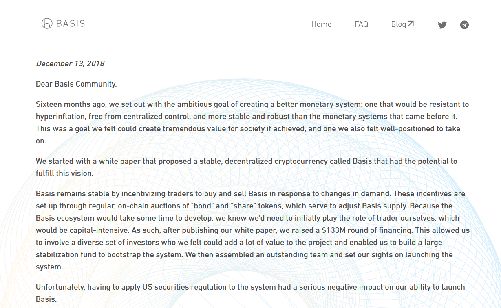

# Алгоритмические стэйблкойны: поиск Святого Грааля

Виды стэйблкойнов по типу обеспечения:

- fiat-collateralized (Tether, USDC)
- crypto-collateralized (Dai)
- commodity-collateralized
- non-collateralized (algorithmic)

Dashboard: https://stablecoins.wtf/

## Введение:

Алгоритмические стэйблкойны - монеты, не обеспеченные никаким реальным или цифровым активом (collateral), и которые вместо этого строятся на сложной комбинации алгоритмов (воздействующих на цену или предложение) и трюках из теории игр.

Т.е. если упростить, то они выпускают токены на рынок, когда цена растет, и покупают их с рынка, когда цена токена меньше необходимой.

Почему они важны:

- убирают волательность крипты
- censorship resistance
- могут быть масштабированы до необходимых размеров
- сеньораж остается в экосистеме и делится с пользователями экосистемы
- увеличивает доверие, так как код и все, что происходит, может легко быть проверено
- полная прозрачность того, что происходит
- управление, нацеленное на интересы пользователей (в отличие от центробанков)
- огромный трансформационный потенциал такой технологии (больше, чем токены Bitcoin'а и Ethereum). Сохраняет плюсы, убирает минусы.

Что говорят противники:

- Оracle problem
- The central bank game (даже ЦБ не всегда справлялись с этой задачей, несмотря на ресурсы; трэйдерам выгодно шортить, так как исходы легко прогнозирумы)
- Not really stablecoins (if pegged to USD)

## Rebase coins: Ampleforth (Yam, Based Money)

Rebase coins изменяют предложение в зависимости от рыночной цены на монету.
Эти изменения предложения называются "ребэйзы" (rebases).
Ребэйзы не меняют пропорцию монет принадлежащих пользователю, т.е. активы пользователи не размываются.

https://www.coingecko.com/en/categories/rebase-tokens

### Ampleforth

Привязан к U.S. dollar’s 2019 Consumer Price Index (CPI) rate

Stability:

- Если цена > 1.05: positive rebase - новые токены создаются у всех пользователей
- Если цена < 0.95: negative rebase - токенов становится меньше у всех пользователей

Такой подход переносит волательность с цены токена на его капитализацию: вместо изменений цены в зависимости от изменений спроса, для ребэйз токенов изменяется рыночная капитализация, т.е. это больше спекулятивный инструмент, а не стэйбкойн.

https://www.coingecko.com/en/coins/ampleforth (смотреть маркеткап)

https://www.ampleforth.org/basics/

https://www.ampleforth.org/dashboard/ (смотреть корреляцию)

### Yam

Привязан к USDC

Отличительные черты:

- Fair launch через ликвидити майнинг
- On-chian governance from Day 1
- VALUE CAPTURE-> a portion of each supply expansion is used to buy yCRV (a high-yield USD-denominated stablecoin) and add it to the Yam treasury

[Параметры во время запуска](https://medium.com/yam-finance/yam-finance-d0ad577250c7)

### Based

Привязан к sUSD

https://based.money/

Отличительные черты:

- Admin keys are burned
- Сглаженные ребэйзы (over a ten-day period)
- Whale hunting

## Seigniorage coins: Empty Set Dollar и Basis Cash

Особенности:

- Multi-token models
- Rebases do not affect everyone

https://www.coingecko.com/en/categories/seigniorage

### Basecoin/Basis

### Empty Set Dollar

Особенности:

- Two-token model
- ESD выступает в роли и стабильного токена и governance токена.
- Используется механизм купонов, чтобы вернуть цену к цели.

Stability:

- Если цена > 1: создаются новые токены в ESD DAO и раздаются стэйкерам, пропорционально их стэйку (supply expansions до 3%)
- Если цена < 1: системы предлагает пользователям сжечь ESD за купоны. Купоны продаются с дополнительной скидкой. Купон это ваучер, который можно обменять на ESD, когда рыночная цена ESD будет больше 1 USDC (но не более 90 циклов/30 дней)

https://www.coingecko.com/en/coins/empty-set-dollar (показать период стабильности)

### Basis Cash

Особенности:

- Three-token model (stablecoin Basis Cash, bond token Basis Bond, and shareholder token Basis Share)
- BAC - сам стэйблкойн
- BAS - пользователи, которые застэйкали BAS в Boardroom получают заминченный BAC, во время экспансий
- BAB - можно обменять на BAC, когда цена выше 1 (закончилась дефляционная фаза) и он есть в трэжери (Boardroom)

Stability:

- Если цена > 1: создаются новые токены в Boardroom. Сначала они предлагаются владельцам бондов, а потом раздаются стэйкерам BAS, пропорционально их стэйку.
- Если цена < 1: системы предлагает пользователям сжечь BAC за BAB. BAB это ваучер, который можно обменять на BAC (bond redemption), когда рыночная цена BAC будет больше 1 USD. У BAB нет даты экспирации.

https://www.coingecko.com/en/coins/basis-cash

### Forks of Basis and ESD

- Dynamic Set Dollar
- Zero Collateral Dai
- Mythril Cash
- Basis Dollar

## Terra

Особенности:

- Cosmos SDK
- Майнеры получают rewards через transaction fees: каждая транзакция берет с пользователей небольшую плату для майнеров
- Множество токенов (LUNA + TerraStables)
- Ecosystem: CHAI + Mirror + Anchor + другие приложения

Stability:

- Если цена > 1: один доллар луны, можно продать за 1 UST, а потом продать UST и получить прибыль, так как цена UST больше доллара.
- Если цена < 1: один UST можно обменять на эквивалент 1 доллара в луне, и получить прибыль, так как UST меньше доллара.

Следствия:

- Если supply стэйблкойнов на Terra увеличивается, то LUNA supply падает и цена растет
- Если supply стэйблкойнов на Terra уменьшается, то LUNA supply растет и цена падает
- TerraUSD (и др) передает волатильность своему парному токену LUNA через сеньораж: часть LUNA burnиться, часть складывается в community pool
- Чем больше приложений на Terre использует Terra-валюты, тем больше этих токенов нужно => тем больше transaction fees и тем больше спрос на Luna, так как она бернится.

https://www.coingecko.com/en/coins/terra-usd

Ресурсы:

- [Официальное видео](https://www.youtube.com/watch?v=KqpGMoYZMhY)
- [UST Fud Thread](https://twitter.com/terra_money/status/1396780917314621444)
- [UST Fud Video](https://www.youtube.com/watch?v=HL8tcVHyHMM)

## Frax

Особенности:

- Первый частично коллатерализованный стэйблкойн: частично обеспечен коллатералом, частично стабилизируется алгоритмически (отсюда название - fractuonal-algorithmic)
- FRAX - стэйблкойн, FXS (Frax Shares) - governance токен.
- No active management
- Пропорция алгоритмической части к обеспеченной не фиксирована, а вариативна и зависит от рыночной цены FRAX (в V1) или более хитрых схем (PIDController)
- Функция обновления collateral ratio может быть вызвана любым пользователем раз в час. Функция изменяла collateral ration шагами .25%. Если цена токена больше 1 USDC, то алгоритмическая часть увеличивается и наоборот.
- После запуска FRAX был на 100% обеспечен, но постепенно это значение уменьшалось.
- FRAX всегда можно заминтить или заредимить в систему за 1 доллар стоимости.
- Множество механизмов стабилизации цены и уменьшения волатильности.
- Frax - это agnostic protocol. Ему без разницы, какой уровень колларетализации в итоге будет выбран рынком.

Stability:

- Если цена > 1: арбитражники минтят FRAX используя USDC и FXS, продают FRAX с прибылью и повторяют это до тех пор, пока возможность арбитража не пропадает.
- Если цена < 1: арбитражники покупают FRAX и редимят (redeem) в системе, получая USDC и FXS взамен. Продают FXS с прибылью и повторяют это до тех пор, пока возможность арбитража не пропадает.

https://app.frax.finance/

https://www.coingecko.com/en/coins/frax

### Titan

- Кто-то продает много TITAN'а, цена прыгает, инвесторы начинают нервничать и тоже начинают продавать.
- IRON отклоняется от целевого значения (IRON < 1 USD), что ведет к ситуации, когда токен который стоит на рынке 0.90$ , можно заредимить в системе за 0.75$ в стэйблкойне и 0.25$ в TITAN.
- TITAN) сливается на рынке => его цена падает еще больше => пользователи паникуют еще больше => цена IRON отклоняется от целевого значения еще больше => cамоподдерживающийся цикл (пока IRON != 1 USD, TITAN падает; и пока TITAN падает и IRON не может быть = 1 USD).

## Rai, Fei, Float

### Rai

Особенности:

- Альтернатива pegged-coins для использования в DeFi в качестве коллатерала и резервного актива
- Монетарная политика управляется автономным алгоритмическим on-chain контроллером
- Форк Multi-Collateral DAI, где stability fee заменена на redemption price (целевая стоимость RAI)
- Over-collateralised debt system
- RAI - non-pegged stablecoin
- Начальная целевая цена RAI (redemption price) составляла $3.14
- Redemption price - обратно коррелирует со спросом на RAI (цена уменьшается, если спрос на RAI растет) и прямо коррелирует со спросом на левередж Эфира (позитивная корреляция с ценой ETH).

“It works kind of like a spring: the further the market price of RAI moves from the target price, the more powerful the interest rate, and the greater the incentive to return RAI to equilibrium”

Stability:

- Если рыночная цена > redemption price: система сдвигает redemption price еще больше вниз. Это позволяет кому-то заминтить новые RAI по более низкой цене и продать их за ETH.
- Если рыночная цена < redemption price: система сдвигает redemption price еще больше вверх. Это делает содержание SAFE более дорогим. Пользователи закрывают SAFE (сжигают RAI и анлочат ETH), что поднимает цену RAI.

Limitations:

- Not capital efficient
- При спросе на RAI, опережающем рост цены ETH, может возникнуть ситуация, когда RAI дешевеет. Это может уменьшить покупательскую способность токена.

https://stats.reflexer.finance/

https://reflexer.finance/faq

### Fei

Особенности:

- FEI привязан к 1.00 USD
- Fei частично коллатерализованая система, с начальным коллатералом только в ETH
- Использует bonding curves и direct incentives
- Весь этот коллатерал не user-owned, а PCV-owned
- PCV (protocol controlled value)
- На старте в PCV принесли 639000 ETH
- PCV стэйкается на Uniswap в ETH/FEI пуле, при этом необходимый FEI минтится системой в нужных количествах

Stability:

- Если цена > 1: протокол дает пользователям возможность заминтить новые FEI в обмен на эквивалент в $ выражении в ETH. ETH идет в PVC. Например, если рыночная цена FEI составляет 1.05 USD, то любой пользователь может заминтить новые FEI по цене 1.01 USD в ETH и продать на рынке.
  
- Если цена < 1: Direct incentives: за покупку или продажу токена протокол дает пользователю награду или штраф, пропорционально тому, насколько далеко цена от целевой. Этот механизм работает только если цена ниже целевой.
  

Динамика поддержки целевой цены:

Peg reweights: запускаются, если продолжительное время не срабатывают direct-incentives. Контроллер вынимает всю ликвидность, предоставленную протоколом, из ETH/FEI пула и покупает FEI за ETH, сжигает купленный FEI. Таким образом цена возвращается к целевой, но у протокола становится меньше коллатерала.

Limitations:

- Падение цены коллатерала может повлиять на PCV и как следствие вызвать падение доверия к системе
- Также такое падение снижает возможность проводить reweights (при достаточных объемах reweights могут делать цену коллатерала еще меньше, а также уменьшать его объем, что уменьшает доверие к системе еще больше)

### Float

Особенности:

- Первая по-настоящему нативная валюта для интернета
- FLOAT - non-pegged stablecoin
- Система из двух токенов
- Частично коллатерализованная система (ETH в v1)
- Basket - аналог PCV, пользователи не могут напрямую взаимодействовать с ETH застэйканым там
- Начальная целевая цена FLOAT (redemption price) составляла $1.618 (золотое сечение)
- Целевая цена FLOAT позитивно коррелирует со спросом на FLOAT и также позитивно коррелирует с ценой ETH
- Протокол использует Basket для изменений цены, через механизм Dutch Auctions
- Протокол настроен так, чтобы всегда целевой объем коллатерала соответствовал целевой цене FLOAT (Basket Factor = 100%)
- Цена FLOAT более чувствительна к изменениям цены коллатерала, таким образом сохраняется покупательная способность пользователей
- Но в случае длительного bear market и падения стоимости коллатерала, цена FLOAT будет падать, хоть и более плавно

Stability:

- Если цена > target price: любой пользователь может начать аукцион по продаже системой FLOAT. Система выпускает новые монеты FLOAT и начинает на них аукцион начиная с рыночной цены + premium. Постепенно цена снижается до target price. Арбитражники покупают FLOAT за ETH + BANK.
  Например: целевая цена 2 USD, рыночная цена 3 USD. Постепенно цена аукциона опускается до 2.90 USD и арбитражник покупает FLOAT при этом платит 2 USD в ETH и 0.9 USD в BANK. BANK после этого сжигается.
- Если цена < target price: протокол начинает Reverse Dutch Auction по покупке протоколом FLOAT. Начальная цена покупки предлагаемая протоколом = рыночная цена - дополнительная скидка. Цена постепенно увеличивается небольшими шагами до target price. Купленный FLOAT сразу же сжигается.

Limitations:

- bank-run, вызванный резким падением цены коллатерала

### OlympusDAO

https://olympusdao.medium.com/comparison-of-olympus-credits-and-the-empty-set-dollar-590146dcdf8b

Особенности:

- the goal is to build a policy-controlled currency system
- in the short term, we intend to optimize the system for growth and wealth creation
- non-pegged stablecoin
- each OHM token is backed by 1 DAI in the treasury
- It is important to understand that OHM does not rebase. Rather, new supply is created via direct sales into the market and burned via direct purchases from the market.
- Initial profit distribution will be 90% to stakers and 10% to DAO
- The protocol distributes tokens by sending them to the staking contract without asking for sOHM back
- Есть два механизма: стэйкинг и бондинг
- Стэйкинг - принес OHM и получаешь доход от ребейзов
- Бондинг - отдаешь ликвидность на дексе и получаешь OHM дешевле рынка
- У протокола получается два трэжери: в даи и в LP токенах

Stability:

- Если OHM < 1 DAI: the protocol buys back and burn OHM
- Если OHM > 1 DAI: the protocol mints and sells new OHM

Because the treasury must hold 1 DAI and only 1 DAI for each OHM, every time it buys or sells it makes a profit. It either gets more than 1 DAI for the sale, or spent less than 1 DAI on the purchase.

### Liquity

Особенности:

- Zero governance
- Dual-token design
- LUSD is soft-pegged to USD
- 110% over-collateralized by ETH
- LUSD - stablecoin, LQTY - value accrual (borrowing fee, redemption fee)
- Чтобы заминтить LUSD пользователь депозитит ETH в trove (vault)
- Заминтить можно с уровнем коллатерализации 150%
- Borrowing fee 0.5% на запуске, но определяется алгоритмом (algorithmically adjust based on the last redemption time), может быть в диапазоне 0.5% - 5%
- Redemption fee: увеличивается с каждым последующим redemption в зависимости от объема и уменьшается, если нет redemptions
- Decentralization: только ETH, нет своего фронтэнда, нет гавернанса и нет admim keys
- Может использовать LUSD застэйканый в Stability pool для auto liquidations, а вырученный эфир делить про-рата между стэйкерами в Stability pool

Stability (soft peg):

- Если LUSD < 1 USD: закрывать открытые loans. Также Redemption - пользователь может обменять LUSD на ETH по face value (когда цена на рынке меньше 1 USD), то система возьмет ETH из trove с наименьшей коллатерализацией
- Если LUSD > 1 USD: открывать новые loans

### Abracadabra

https://abracadabra.money/

### Reserve

https://reserve.org/en/
https://podcasts.google.com/feed/aHR0cHM6Ly9mZWVkcy5zaW1wbGVjYXN0LmNvbS9sS21RREc5Ug/episode/ZjI5MDE5M2EtMTAzMy00NWJkLWJmNzMtYzdjNzQyYzRhMGU0?ep=14

## Выводы:

- Создание алгоритмических стэйблкойнов, которые могут поддерживать свою целевую цену очень сложная задача, требующая хорошо сбалансированной системы стабилизационных механизмов.
- Одним из важнейших компонентов, о которых должны думать создатели такой системы (кроме работающих механизмов стабилизации) является трастовость. Т.е. вера пользователей в то, что система будет стабильна. Даже для overcollateralized систем потребовались годы для того, чтобы пользователи начали доверять им.
- Быстрые эксперименты с реальными деньгами, которые невозможно провести в реальном мире, позволяют быстро определить, что работает, а что нет и пойти дальше.

